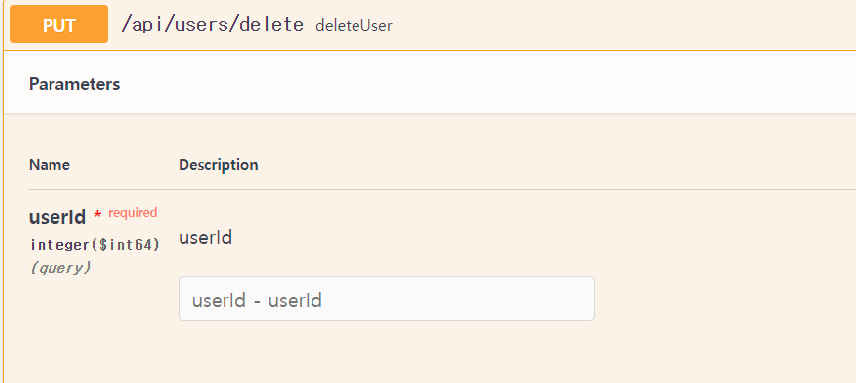

## 1. Get, Path


- path인 경우엔, JS의 경우 백틱(``)과 ${} 을 이용하여 변수를 직접 넣어주면 편리하다

---

## 2. Query



```jsx
UseAxios.put(`/users/delete`,null,  {params : {userId: userData.userId}})
```

- query 형태는 config 안에 params로 들어간다
- 비동기 요청을 보낼 때 Axios.method(uri, data(body), config(param 들어갈 곳)) 임을 명시

 

## 3. Body


- Body는 Axios 객체의 두 번쨰 인자로 전해주면 된다

```jsx
UseAxios.put('/users/passwords/edit', {
              password: data.password,
              newPassword: data.newPassword,
              userId: userData.userId,
            })
```

## 4. Formdata


악명높은 친구

- 폼데이터에 이미지 형식으로 넣고, 해당 DTO, 즉 객체 형테를 JSON.stringify() 해서 폼데이터안에 이름을 맞추고, 스트링 형태로 넣어준다
- 이미지는 라이브러리를 이용해 타입을 구해주기도 한다
- 헤더에 타입도 변경

```jsx
const onSubmit = (data) => {
    console.log(userData);
    console.log(data);
    const formdata = new FormData();
    const filename = imgSource !== null ? imgSource.split('/').pop() : null;
    const imgData = {
      uri: imgSource,
      type: mime.getType(imgSource),
      name: filename,
    };
    imgSource !== null ? formdata.append('image', imgData) : null;
    const newData = {
      userId: userData.userId,
      nickname: data.nickname,
      img: userData.img,
      genderCode: userData.genderCode,
      mbti1Code: userData.mbti1Code,
      mbti2Code: userData.mbti2Code,
      mbti3Code: userData.mbti3Code,
      mbti4Code: userData.mbti4Code,
      age: userData.age,
    };
    formdata.append('userDTO', JSON.stringify(newData));

    console.log(formdata);
    UseAxios.put('/users/profiles/edit', formdata, {
      headers: {'Content-Type': `multipart/form-data;charset=UTF-8`},
    })
      .then((res) => {
        setUserData(res.data);
      })
      .catch((err) => {
        console.log(err);
      });
  };
```