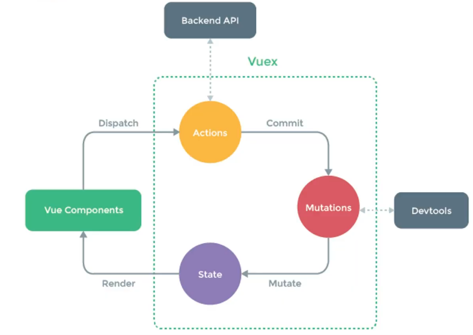

# 22/05/09

## Vuex

### Vuex

- Vue.js 애플리케이션에 대한 **상태관리패턴 + 라이브러리**
  - 상태 : 데이터
- 애플리케이션 모든 컴포턴트들의 중앙 저장소 역할(데이터 관리)
- 부모 자식 단계가 많이 복잡해 진다면 데이터의 전달하는 부분이 매우 복잡해 짐.
- 애플리케이션이 여러 구성 요소로 구성되고 더 커지는 경우 데이터를 공유하는 문제 발생
- devtools 확장 프로그램과 통합되어 고급 기능 제공

---

### 비 부모 자식간 통신

- 두 컴포넌트가 통신할 필요가 있지만 서로 부모/자식이 아닐 수도 있음
- 비어있는 Vue Instance 객체를 Event Bus로 사용(is the 복잡스)
- **자식** emit 자식 emit -자식 emit  - 부모 prop 자식 prop **자식**
- **자식** emit  Event Bus prop **자식**

- 큰 하나의 저장소를 만들어서, 모든 데이터 관리할래!
  - 하나 바꾸면, 알아서 동기화 돼!

---

### 상태 관리 패턴

- **상태**는 앱을 작동하는 원본 소스입니다
- **뷰**는 **상태**의 선언전 매핑입니다
- **액션**은 **뷰**에서 사용자 입력에 대해 반응적으로 **상태를 바꾸는 방법**입니다.
  - 단방향 데이터 흐름 : State -> View -> Action -> State -> View -> Action -> ....
  - 부모 자식 관계 단순하면, 사실 바 꿀 필요 없지

---

## Vuex 핵심 컨셉

### Vuex 저장소 개념

- #### State

  - 단일 상태 트리 사용, 애플리케이션마다 하나의 저장소를 관리(data)

- #### Getters

  - Vue Instance의 computed와 같은 역할, State를 기반으로 계산(Computed)

- #### Mutation

  - State의 상태를 변경하는 유일한 방법(method)

- #### Action

  - 상태를 변이 시키는 대신 액션으로 변이(Mutations)에 대한 커밋 처리(비동기 methods)

---

### State

- Vuex는 단일 상태 트리 사용
- 이 단일 객체는 모든 애플리케이션 수준의 상태를 포함하며, " 원본 소스 " 의 역할
- 각 애플리케이션 마다 **공유해야 할 data 관리**
- State에 접근 방식 : **this.$store.state.데이터이름**
- computed를 사용하여 데이터를 가져와 사용 가능함
  - 값이 변경되면 해당 state를 공유하는 여러 컴포넌트의 DOM은 (알아서) 렌더링

- 모든 상태를 Vuex에서 괸리 해야 하는 것은 아님
- Vuex에 저장하면 코드가 장황하고 간접적으로 변할 수 도 있음.

---

### Getters

- State를 변경하지 않고 활용하여 계산을 수행(computed 속성과 유사)
- 실제 계산된 값을 사용하는 것처럼 getters는 저장소의 상태를 기준으로 계산
- computed속성과 마찬가지로 state 종속성에 따라 캐시되고, 일부 종속성이 변경된 경우에만 다시 재계산
- getters 자체가 state를 변경하지 않음

---

### Mutations

- Vuex 저장소에서 실제로 상태를 변경하는 유일한 방법
- 각 컴포넌트에서 State의 값을 직접 변경하는 것은 권하지 않음
- mutation의 핸들러 함수는 **반드시 동기적**이야 함
  - 비동기 콜백함수의 실제로 호출 시기를 알 수 있는 방법이 없음, 추적 x
- 첫 번째 인자로 항상 state를 받음.
- 1.Mutations는 직접 호출이 불가능하고, store.commit('정의된 이름')으로 호출
  - mutation에서 정의한 메소드 이름
  - INCREMENT : 대문자
- 2.Actions에서 commit() 메서드에 의해 호출
  - incremnet : 소문자

---

### Action

- State를 변이시키는 대신 commit() 메서드를 통해 mutations를 호출
- 비동기 작업의 결과를 적용하려고 할 때 사용(Backend API와 통신 등)
- context 객체 인자를 받음
  - (store.index.js 파일 내에 있는 모든 요소의 속성 접근 & 메서드 호출 가능)
  - (state를 직접 변경할 수 있지만 하지 말기 : 명확한 역할 분담을 하여 올바르게 상태 관리)
- 컴포넌트에서 dispatch() 메서드에 의해 호출

---

### Vuex 언제 사용?

- Vuex는 공유된 상태 관리를 처리하는데 유용하지만, 개념에 대한 이해와 시작하는 비용도 함께 발생
- 앱이 단순하다면 Vuex 없이 괜찮을 수도 있음(간단한 글로벌 이벤트 버스 OK)
- 중대형 규모의 SPA를 구축하는 경우 Vue 컴포넌트 외부의 상태를 보다 잘 처리할 수 있는 방법을 생각하게 될 가능성이 있게 되고, 자연스럽게 Vuex를 선택할 수 있는 단계가 됨
- 필요한 순간에 활용할 것

- Flux 라이브러리는 안경과 같습니다. 필요할 때 알아볼 수 있습니다(Dan Abramov)
