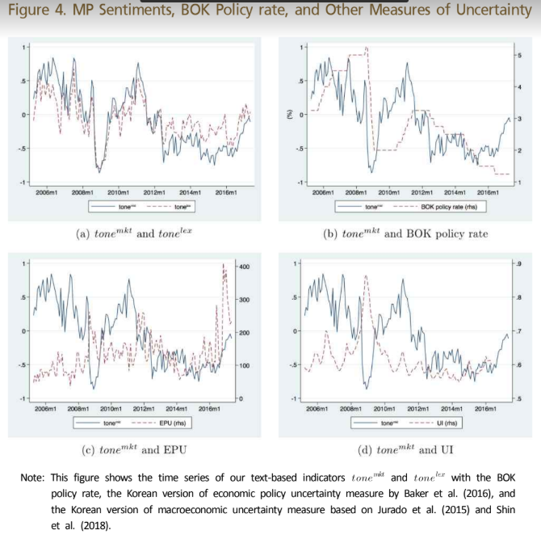

by ysubg 1gram - 5gram  -> we can consider the context

(Lower unemplyment, sluggish recovery)

in order to distunguish certain language, we're going to use 2 kinds of sentiment indicators

- marketing approach
  - pros : do not rely on the researcher's subjecteive selection of seed words
    -  use only market informations
  - cons: naturally produce statistically significant outcomes
- lexical approach
  - pros : polarity based on proximity(근접)  to the pre-determined seed words

So we use state-ofthe-art domain-specific sentiment induction algorithm

'SentProp'

'eKoNLPy'

previous : frequency //// rely more on tones/sentiments

!!방법론!!

네이버 따로 인포맥스 따로

We collect *231,699 documents for the period of May 2005–December
2017, which include 151 minutes of MPB meetings, 206,223 news
articles, and 26,284 bond analyst reports. Table 2 shows the types and
numbers of documents and the average and maximum number of
sentences. While our target texts are the MPB minutes, we use a large
amount of other documents to build field-specific lexicons.

##  News Articles

January 2005 to December 2017.8)

The number of news articles for our final use is 206,223. Among them, 42% (86,538) are from Yonhab Infomax, 33% (68,728) from EDAILY, and 25% (50,957) from Yonhab News.

연합 인포맥스 따로

네이버 따로

## 1.3 Bond Analysts’Reports

WIEfn, https://www.wisereport.co.kr/

corpus : we extract using
Latent Dirichlet Allocation (LDA) method, a topic modeling method. Table

# 2. Pre-processing Texts

## 2.1 Typical Steps of Pre-Processing

tokenize -> pos tag -> 

normalize ->  reomoving punctuation, stop words removal, converting numbers to their wordequivalents, stemming, lemmatization, and case folding.10)

## 2.2 Korean NLP Python Library for Economic Analysis (eKoNLPy)

1. use eKoNLPy

4. we use lemmatizition ( reason)

# 3. Feature Selection

To address this trade-off, we set the n of n-gram to 5 with additional
rules.

1. (NNG), adjectives (VA, VAX), adverbs (MAG), verbs (VA), and negations.17)
2. also drop n-grams that occur less frequently than 15 times.18)

result : 

The final word set is comprised of 2,712 words and we obtain the
resulting 73,428 n-grams.

using 1 gram to 5 gram

# 4. Polarity Classification

## 1st issue : supervise vs unsupervised

supervised : Google Cloud Sentiment Analysis API

unsupervised : PMI (Pointwise Mutual Information)

## 2nd issue : machine-learning-based vs. lexical-based

1. market approach that classifies polarity from market information using machine learning
2. corpus-based approach that classifies polarity using word(ngram) embedding seed words -> lexical

### MARKET APPROACH

For our market approach, we use the Na ̈ıve Bayes classifier (NBC),

we label news articles and reports in our corpus as hawkish (dovish) if the
1-month change of Call rates is positive (negative) on the day they are
released.25)

training set and a test set by 9:1 ratio.26)

we repeat this procedure 30 times and use the
average of the polarity scores as a final one.

We classify the polarity of our lexicon as hawkish (dovish) if the
polarity score is greater (less) than 1, excluding lexicon in the grey area
using intensity of 1.3 as a threshold.30) The final number of lexicon is
18,685 for hawkish and 21,280 for dovish. A sample of polarity lexicon is
provided in table 4.

### Lexical Approach

main idea : if two words appear together frequently in the same context, they are likely to have the same polarity. Then the polarity of an unknown word can be determined
by calculating the relative frequency of co-occurrence with another word.

1. PMI (Pointwise Mutual Information).

2. SO-PMI (Semantic Orientation from PMI)

cons:

- fails to recognize antonyms because it judges the polarity based on co-occurrence.
  - -> we use ngram2vec by Zhao, Liu, Li, Li, and Du (2017) instead of word embedding.
- Second, the outcome is affected by choices of seed words.
  - SentProp framework by Hamilton et al.
  - addresses this issue by bootstrapping seed words.

ngram2vec 

 too many(344,293 unique n-grams with a minimum frequency limit of 25, which yield 410,902,512 pairs of n-grams (21.7 GB in size).)... 

so we bootstrap by running our propagation 50times over 10 random equally sized subsets of  hawkish and dovish seed sets

--- determination : polarity score is greater (less) than 1,

excluding lexicon in the grey area using intensity of 1.1 as a threshold.

## 4.3, Evaluation

the BOK Governor’s news conference about monetary policy decisions.

May 2009 to January 2018,

we manually label 2,341 sentences as hawkish, neutral, and dovish.

- we train a Na ̈ıve Bayes classifier with randomly selected
  60% of hawkish and dovish sentences
- test with the remaining
  sentences.

With 30 times of iteration, the average accuracy of classifiers is
about 86%, which we think is above par accuracy.

# Measuring Sentiments (tones)

2 step approach

we calculate the tone of a sentence based on the
number of hawkish and dovish features (n-grams) in each sentence.

whole tone -> define tone of document

수식

creates a continuous variable  for each document, which is
bound between −1 (dovish) and +1 (hawkish).33)

1.  Can our lexicon-based indicators (tone(mkt) and tone(lex) explain the
   BOK’s current and future monetary policy decisions? In particular,
   do they have additional information that are not available in the
   existing macroeconomic data?
   - yes!
   - 
2. Is it important to use a field-specific dictionary?
3. Is it important to use the original Korean text, not Korean-to-English
   text?

# 5. empirical Analysis

1. tone(mkt)와 tone(lex)가 현재와 미래의 정책을 결정하는데 설명 돼?

   - 더 나아가, 기존 거시경제 데이터 말고 다른 정보를 주지 않을까

     -> Yes! 

     Talylor rule -> 매 ! 금리 올려, 비둘기! 금리 내려서 저축하지 말고 써!

     

2.  전문적인 사전(dictionary)를 사용하는게 중요한가?(eKoNLPy)

   - 그렇다

3. 한글을 영어로 번역해서 돌리는 것 보다 한국어 그 자체를 분서가는게 중요해?

   - 그렇다

figure

Figure 4 - (a) : tone(mkt)와 tone(lex)와의 관계, Corr = 0.85로 매우 높게 나옴(시계열)

(b)는 tonemkt와 금리 

(c)는 최근의 경제 외기 빼고는, 규칙 낮음(cor = -0.06)

(d) -0.54 의미 있는 설명이 돼

FIgure 5도 생각보다 상관계수들이 높게 나옴 , 절댓값들이다 0.3 이상 

# 2. Explaining the BOK's Monetary Policy Decisions

현재와 미래를, 우리가 가진 lexcion-based-indicators를 통해 예측해보겠다

probit model :선택 확률이 [0,1]사이의 구간에 위치시키기 위해 설명변수와 선택확률 사이에 비선형 관계를 요구함

이 비선형 관계를 표준정규분포의 누적확률분포함수를 이용해 , 그리고 이 함수를 

ex) 구매 가격에 따른 재구매 여부, 구매 가격은 정규분포 형태를 띄지만 어느 가격 이상이면 구매한다 라고 가설을 세웠으므로 누적확률분포를 이용한다.

여러가지 변수들의 변화량을 통해 MP(t) :한국은행 금융 정책의 스탠스를 볼건데,

뚜렷한 경향이 있다고 가정하지 않기 위해 (정상성을 위해) 이상한 변수를 붙임(X)

그런데 이 X가 사실 우리가 구한 tone(mkt)랑 tone(lex)일 거여..

복잡한 모형을 통해 기존 거시경제 데이터(market data)들로 설명하지 못한 부분을 설명해주면 우리가 구한 변수 2개는 매우 significant한 변수야, 

근데 현실은 기존 변수들보다 더 좋다고 나옴, 심지어 설명력(R2)값도 오지게 높임..

# 3. Comparison with Other Text-Based Indicators

